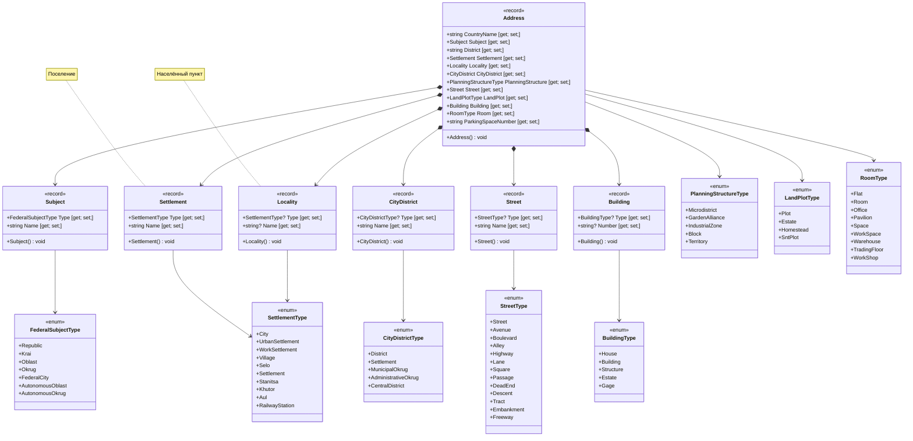

```mermaid
classDiagram
    class Address {
        <<record>>
        +string CountryName [get; set;]
        +Subject Subject [get; set;]
        +string District [get; set;]
        +Settlement Settlement [get; set;]
        +Locality Locality [get; set;]
        +CityDistrict CityDistrict [get; set;]
        +PlanningStructureType PlanningStructure [get; set;]
        +Street Street [get; set;]
        +LandPlotType LandPlot [get; set;]
        +Building Building [get; set;]
        +RoomType Room [get; set;]
        +string ParkingSpaceNumber [get; set;]
        +Address() void
    }

    class Subject {
        <<record>>
        +FederalSubjectType Type [get; set;]
        +string Name [get; set;]
        +Subject() void
    }

    note for Settlement "Поселение"
    class Settlement {
        <<record>>
        +SettlementType Type [get; set;]
        +string Name [get; set;]
        +Settlement() void
    }

    note for Locality "Населённый пункт"
    class Locality {
        <<record>>
        +SettlementType? Type [get; set;]
        +string? Name [get; set;]
        +Locality() void
    }

    class CityDistrict {
        <<record>>
        +CityDistrictType? Type [get; set;]
        +string Name [get; set;]
        +CityDistrict() void
    }

    class Street {
        <<record>>
        +StreetType? Type [get; set;]
        +string Name [get; set;]
        +Street() void
    }

    class Building {
        <<record>>
        +BuildingType? Type [get; set;]
        +string? Number [get; set;]
        +Building() void
    }

    Address *--> Subject
    Address *--> Settlement
    Address *--> Locality
    Address *--> CityDistrict
    Address *--> Street
    Address *--> Building
    Address --> PlanningStructureType
    Address --> LandPlotType
    Address --> RoomType

    class FederalSubjectType {
    <<enum>>
        +Republic
        +Krai
        +Oblast
        +Okrug
        +FederalCity
        +AutonomousOblast
        +AutonomousOkrug
    }
    Subject --> FederalSubjectType

    class SettlementType {
        <<enum>>
        +City
        +UrbanSettlement
        +WorkSettlement
        +Village
        +Selo
        +Settlement
        +Stanitsa
        +Khutor
        +Aul
        +RailwayStation
    }
    Settlement --> SettlementType
    Locality --> SettlementType

    class CityDistrictType {
        <<enum>>
        +District
        +Settlement
        +MunicipalOkrug
        +AdministrativeOkrug
        +CentralDistrict
    }
    CityDistrict --> CityDistrictType

    class PlanningStructureType {
        <<enum>>
        +Microdistrict
        +GardenAlliance
        +IndustrialZone
        +Block
        +Territory
    }

    class StreetType {
        <<enum>>
        +Street
        +Avenue
        +Boulevard
        +Alley
        +Highway
        +Lane
        +Square
        +Passage
        +DeadEnd
        +Descent
        +Tract
        +Embankment
        +Freeway
    }
    Street --> StreetType

    class LandPlotType {
        <<enum>>
        +Plot
        +Estate
        +Homestead
        +SntPlot
    }

    class BuildingType {
        <<enum>>
        +House
        +Building
        +Structure
        +Estate
        +Gage
    }
    Building --> BuildingType

    class RoomType {
        <<enum>>
        +Flat
        +Room
        +Office
        +Pavilion
        +Space
        +WorkSpace
        +Warehouse
        +TradingFloor
        +WorkShop
    }
```
